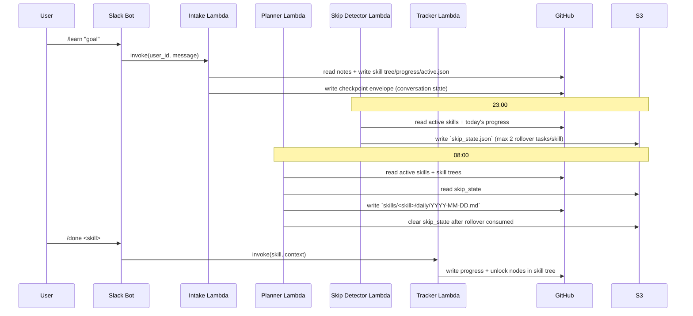

# SkillOS Agents: Communication and State

This diagram shows which runtime components are in play, how signals move, and where state is persisted.

```mermaid
flowchart TD
    U[User in Slack] --> B[Slack Bot Lambda<br/>`skillos_slack/bot.py`]

    B -->|`/learn`| I[Intake Lambda]
    B -->|`/done`| T[Tracker Lambda]
    B -->|`/skillos ...`| S[Supervisor Lambda]
    B -->|`/skip`| S3[(S3<br/>`skip_state.json`)]
    B -->|`/harder` `/easier` `/pause` `/resume`| G[(GitHub Repo<br/>`skills/active.json`)]

    EB1[EventBridge 08:00] --> P[Planner Lambda]
    EB2[EventBridge 23:00] --> SD[Skip Detector Lambda]

    S -->|intent=intake| I
    S -->|intent=track| T
    S -->|intent=query/action| G
    S -->|skip/reshuffle| S3
    S -->|reshuffle invoke| P

    I --> LGI[Intake StateGraph]
    T --> LGT[Tracker StateGraph]
    P --> LGP[Planner StateGraph]

    LGI --> BR[Bedrock LLM]
    LGT --> BR
    LGP --> BR

    I --> G
    T --> G
    P --> G
    SD --> G
    P --> S3
    SD --> S3

    I --> CP[GitHub Checkpointer<br/>`.langgraph/intake-{user_id}/latest.json`]
    CP --> G
```



## State Ownership

- `GitHub` is the durable source of truth for skills, task plans, progress logs, and intake checkpoints.
- `S3` holds short-lived coordination state (`skip_state.json`) shared between Skip Detector and Planner.
- Lambdas are stateless between invocations; context is reconstructed from GitHub/S3 each run.
- Agents do not communicate directly with each other in-memory; communication is event-driven and file/state mediated.


## Command to Agent Mapping

| Slack Command | Routed Agent / Component | Python File |
|---|---|---|
| `/learn <goal>` | Intake Agent (Lambda) | [`agents/intake/handler.py`](../agents/intake/handler.py) |
| `/done <skill> [note]` | Tracker Agent (Lambda) | [`agents/tracker/handler.py`](../agents/tracker/handler.py) |
| `/skillos <message>` | Supervisor Agent (Lambda) | [`supervisor/handler.py`](../supervisor/handler.py) |
| `/reshuffle-tasks` | Planner Agent (Lambda invoke) | [`agents/planner/handler.py`](../agents/planner/handler.py) |
| `/skip <skill>` | Direct skip-state writer (no agent graph) | [`skillos_slack/bot.py`](../skillos_slack/bot.py) |
| `/harder <skill>` | Direct difficulty updater | [`skillos_slack/bot.py`](../skillos_slack/bot.py) |
| `/easier <skill>` | Direct difficulty updater | [`skillos_slack/bot.py`](../skillos_slack/bot.py) |
| `/pause <skill>` | Direct status updater | [`skillos_slack/bot.py`](../skillos_slack/bot.py) |
| `/resume <skill>` | Direct status updater | [`skillos_slack/bot.py`](../skillos_slack/bot.py) |
| `/skills` | Direct query handler | [`skillos_slack/bot.py`](../skillos_slack/bot.py) |
| `/skill` | Alias of `/skills` | [`skillos_slack/bot.py`](../skillos_slack/bot.py) |
| `/list-all-skills` | Direct query handler | [`skillos_slack/bot.py`](../skillos_slack/bot.py) |
| `/todays-tasks` | Direct query handler | [`skillos_slack/bot.py`](../skillos_slack/bot.py) |
| `/remaining-tasks` | Direct query handler | [`skillos_slack/bot.py`](../skillos_slack/bot.py) |
| `/why-tasks` | Direct deterministic DAG explanation | [`skillos_slack/bot.py`](../skillos_slack/bot.py) |