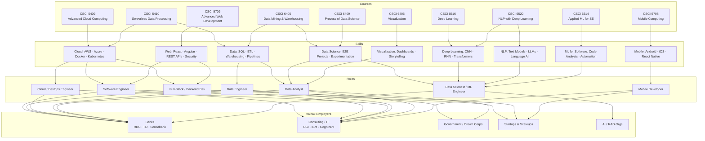

# Researching employability impact

**Priority:** Medium

## Conversation

### Assistant

Below is a **clean, Obsidian-ready Mermaid diagram** that **summarises the employability analysis**, **categorised by courses**, and shows how each course connects to **skills → roles → employers in Halifax**.

You can paste this directly into Obsidian / Markdown that supports Mermaid.

---

---

### How to read this diagram (quickly)
- **Top → Bottom flow**:  
  **Course → Skills → Job Roles → Halifax Employers**
- Courses higher in demand (Cloud, Web, Data) connect to **more roles and more employers**
- Specialized courses (NLP, ML for SE, Mobile) connect to **fewer but niche paths**
- This visually explains **why Cloud + Web + Data courses rank highest for employability**

---

### If you want next
I can:
- Create a **second Mermaid diagram showing recommended course bundles**
- Convert this into an **Obsidian MOC page**
- Add **weighting labels** (High / Medium / Low demand) on edges
- Produce a **one-page visual decision chart** for final course selection

Tell me what you want next.

---

