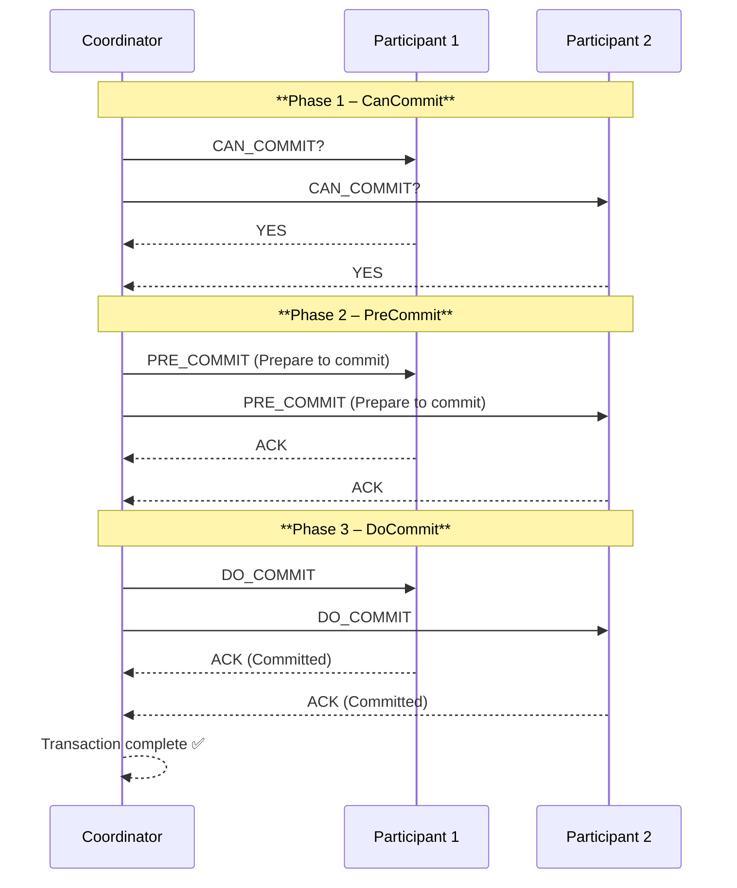

# Heterogeneous transparency DDBMS

**Priority:** Medium

## Conversation

### Assistant

Here’s a **Mermaid sequence diagram** for the **Three-Phase Commit (3PC)** protocol — ready to paste into Obsidian:

### 🔹 Key Difference from 2PC
3PC adds the **Pre-Commit phase** to reduce blocking:
- Participants are informed to prepare but not yet commit.  
- If the coordinator fails after pre-commit, participants can still reach a consistent decision without indefinite waiting.

---

