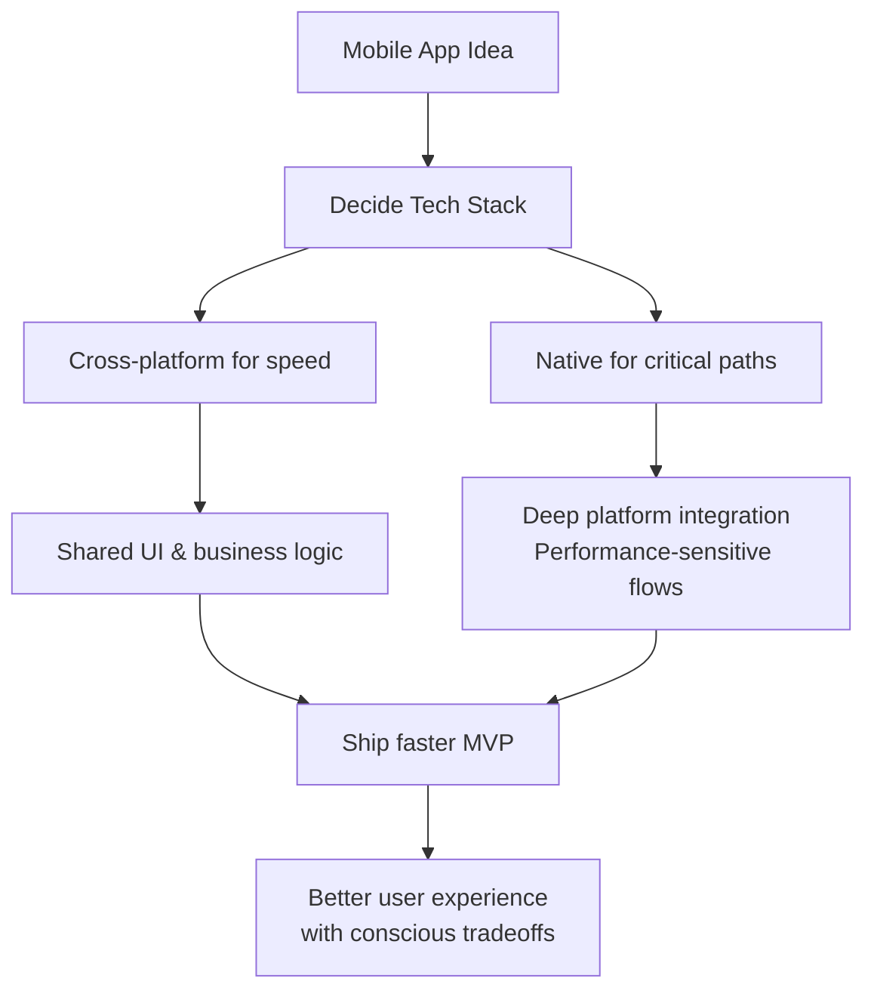

Some days it feels like every conversation about mobile starts with, “Which cross‑platform framework are you using?”

But when you get closer to real users, the question quietly shifts to, “Does this app feel fast, reliable, and trustworthy on my phone?”

Native still wins in places we rarely talk about in slides: the tiny haptics when you tap a button, the subtle scroll physics, the camera that just works when the network is flaky, the battery that doesn’t quietly drain in the background.

You can absolutely ship with cross‑platform tools. I’m doing that too, and they’re powerful. But when performance, platform-specific polish, or deep integration really matter, native still gives you that last 10–20% of quality you can feel but can’t easily measure.

Maybe the better question isn’t “native or cross‑platform?” but “where in this product do users actually need native-level experience, and where can we safely abstract?”

How are you deciding that line in your current project?

## Diagram (Mermaid)

# outline
- Hook: Everyone asks “which framework?” but users care about feel
- Contrast: Hype around cross‑platform vs quiet expectations of users
- Detail: Where native still wins (performance, polish, integrations, battery)
- Nuance: Cross‑platform is still useful, but not everywhere
- Key question: Where do you actually need native-level experience?
- CTA: Ask readers how they draw that line in their own projects

