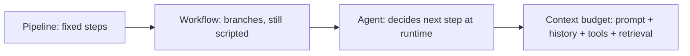

Yesterday we had Pavankumar from DeepSense in our classroom invited by  Professor Lu Yang to guest-teach on agentic AI.

I'm still sorting the vocabulary in my head. Pipeline vs workflow vs agent isn't just naming. It's about who decides the next step. A pipeline runs a fixed sequence. A workflow branches, but the branches are still written in advance. An agent observes, reasons, and chooses what to do next at runtime.

That maps cleanly to model → assistant → agent. The model generates text. The assistant adds memory and a system prompt. The agent adds tools, loops, and actions that actually change something outside the chat window.

What stuck with me wasn't theory alone — it was the production n8n systems he described. A meeting assistant that pulls action items, owners, and deadlines from transcripts and updates calendars. An invoice agent that reads emails, parses structured fields, and writes to a database. Simple on paper, brutal in the details.

He also walked through Anthropic-style patterns — chaining, routing, parallel calls, orchestrator–workers, evaluator–optimizer loops. Useful labels. But the honest lesson underneath keeps showing up in my notes: most failures are context failures, not "IQ" failures. The window is finite. Everything competes — system prompt, history, tools, retrieved docs. And bigger context isn't always better; past a point, more tokens can make answers worse.

I kept mapping it to what I'm building. **coinBaby** (my CSCI 5409 cloud project) is a personal finance app where Penny chats over Bedrock — a lot of the grind isn't the model, it's the AWS stack (FastAPI on EC2, RDS, Cognito, Terraform) and deciding what user context actually crosses the wire. **GroundSense** is where I'm pushing further toward "agentic" in the sense we discussed: a Bedrock Agent for earthquake Q&A that picks tools — real-time feeds, historical SQL over a data lake, RAG on narrative reports — instead of one fixed pipeline. Different projects, same question: what belongs in the window?

So the work isn't just prompt engineering anymore. It's context engineering — what you put in, what you leave out, and how you budget memory across layers.

If you've shipped something agentic, what was the hardest part — the model, the tools, or the context?

---

## Diagram (Mermaid)

---

## outline
- Hook: guest in class — agentic AI with someone shipping real systems
- Clarify pipeline vs workflow vs agent (who decides the next step)
- Map to model → assistant → agent (tools + loop + world impact)
- Concrete: DeepSense n8n — meeting assistant + invoice agent (production, not slide-ware)
- Personal: coinBaby (Bedrock + FastAPI/RDS/AWS) = context-over-the-wire; GroundSense = Bedrock Agent + tools + RAG, not one fixed pipeline
- Bridge: Anthropic-style patterns; real issue = context, not raw capability
- Insight: context engineering > prompt-only craft
- CTA: single question on what was hardest to ship
