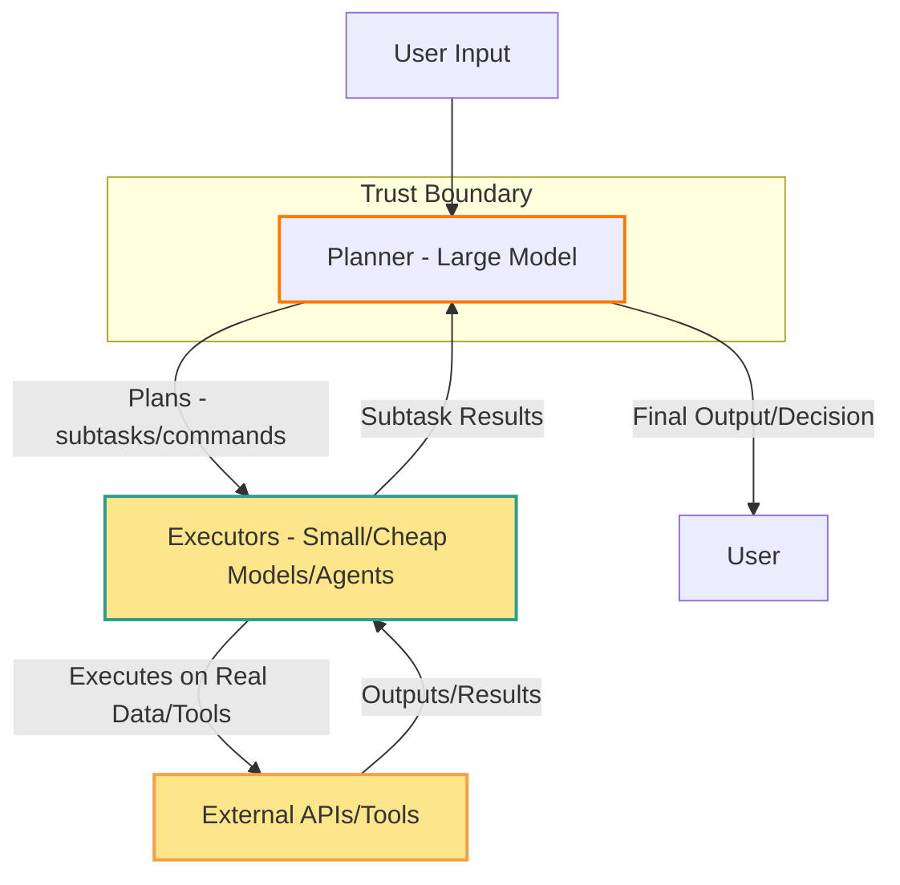

I've been looking at a routing pattern that sounds almost too good to be true: let a stronger model **plan**, and let smaller models **execute** the steps. Work on budget-aware routing and oracle–worker setups suggests you can cut spend sharply versus running everything on a frontier model.

I'm considering it for my next project — but the security side of my brain won't stay quiet.

If execution happens in cheaper models that touch messy inputs and tool outputs, your blast radius changes. Prompt injection isn't just "bad text in a chat" anymore; it's **which** component is allowed to interpret untrusted content, and what authority it has.

So maybe the real question isn't only "which model is cheaper," but "where do we draw the trust boundary?"

Are you treating plan and execute as two different security roles, or one big model with one big assumption?

# outline
- Hook: plan-and-execute / routing sounds like a cost win
- Name the pattern lightly: budget-aware routing, oracle–worker framing
- Personal: considering it for next project; security intuition kicks in
- Concrete risk: executors see untrusted inputs and tool outputs; authority and blast radius shift
- Reframe: injection as a trust-boundary problem, not only a model choice
- CTA: single question on plan vs. execute as security roles

_Above: Trust boundary is drawn around the "Plan" (Planner/Large Model) role. Executors and their environment face untrusted inputs and outputs._
