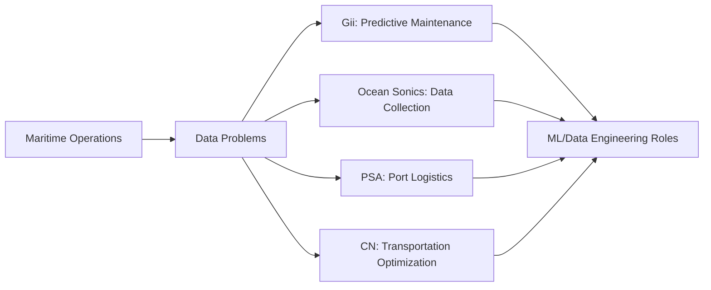

Yesterday our professor @Yang took us to the Pier in Halifax.

He's been in Canada for 23 years. That context alone changed how I listened, this wasn't theoretical career advice. This was someone who'd built relationships with the tech ecosystem here, one conversation at a time.

We were introduced to companies I'd never heard of. DeepSense(only one I knew something about), PSA (Port of Singapore Authority) who have an entire IT department here in Halifax. CN(Canadian National Railway Company), the logistics and transportation giant.

DeepSense is based at Dalhousie University and is Canada’s ocean data innovation environment uniting the next generation of AI and machine learning experts with companies that want to harness the potential of data to lead the smarter ocean economy

Marine Thinking, they make Tesla's but for water for surveying, mapping, environmental monitoring and intelligence gathering. 

OceanSync that designs systems that combine ship sensing, edge computing and advanced cloud data analytics.

But what caught my attention was how specific the problems were.

Git (Graphite Innovation & Technologies) manufactures coating for ships. Sounds simple, right? But they probably need predictive models to determine when ships need servicing. That's a real ML application, not a Kaggle competition.

Ocean Sonics builds hydrophones. The professor said the field is mature and demand is high. Maritime data collection at scale. That's infrastructure that needs engineers who understand both hardware constraints and data pipelines.

We walked through shared office spaces. Met John, the guard with not so great photography skills :), sorry @Devang. 

The lesson wasn't about any single company. It was about industry awareness.

Halifax has a maritime tech cluster I didn't know existed. And now I'm asking: what other industries are hiding in plain sight?

# Updated

Yesterday, Professor Yang took us to the Pier in Halifax. A simple trip, right? But something shifted when I found out he's been in Canada for 23 years.

That context changed everything. This wasn't theoretical career advice delivered from someone reading the internet. This was someone who'd *built* relationships with the tech ecosystem here one conversation at a time. That matters.

We were introduced to companies I'd never even heard of. [[DeepSense]] (honestly, the only one I knew something about). PSA (Port of Singapore Authority), who have an IT department operating out of Halifax. CN, the Canadian National Railway Company a giant in logistics and transportation.

Then there's DeepSense itself. Based right at Dalhousie University. Canada's ocean innovation (but now they have diversified to more industries) environment, they call it. Essentially: next-generation AI and machine learning experts paired with companies hungry to harness data and lead the smarter ocean economy.

GitCoating manufactures ship coatings. Sounds mundane, doesn't it? Except... they need predictive models to determine when ships need servicing. That's *real* machine learning. Not a Kaggle competition. Real infrastructure. Real constraints.

Ocean Sonics builds hydrophones. The field is mature, demand is high. Maritime data collection at scale. That's infrastructure that needs engineers who understand hardware constraints *and* data pipelines simultaneously.

Marine Thinking makes—I kid you not—Tesla's for water. For surveying, mapping, environmental monitoring. Intelligence gathering at sea.

OceanSync designs systems combining ship sensing, edge computing, and advanced cloud data analytics.

We walked through shared office spaces. Met John, the security guard (apologies to @Devang for his photography skills comment, but it was fair).

But here's what I actually learned: it wasn't about any single company.

It was about industry awareness. Halifax has a maritime tech cluster hiding in plain sight. And now I can't stop asking myself: what other industries am I missing? What clusters exist in plain sight that I've simply never noticed?

## Diagram (Mermaid)

# Outline
- Hook: Field trip with professor who's been in Canada 23 years
- Context: Professor's long-term relationships with maritime tech ecosystem
- Specific companies discovered: DeepSense, PSA, CN, Gii, Ocean Sonics
- Real-world problem examples (ship coating prediction, hydrophone data)
- Tangible details: shared office spaces, meeting John the guard
- Lesson: Ecosystem awareness > individual companies
- Realization: Maritime tech cluster in Halifax
- CTA: What local industry clusters are you missing?
