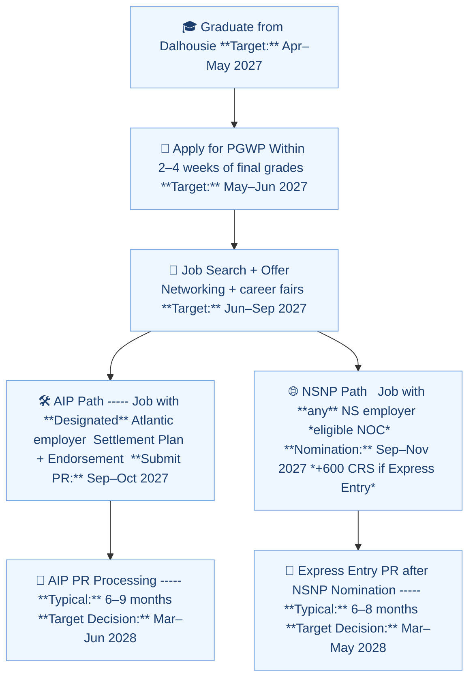

# 🌊 Nova Scotia PNP & PR Pathway (For Harsh & Wife)

## 📈 Visual Representation

## 1. Living & Working in Nova Scotia
- Moving to Nova Scotia makes you eligible for the **Nova Scotia Nominee Program (NSNP)** after certain conditions.  
- Both you (student → graduate → worker) and your wife (open work permit → worker) may qualify.  

---

## 2. Eligibility Overview

### 👨 Harsh (as an International Student)
- Complete studies in Nova Scotia (MACS @ Dalhousie).
- Post-graduation, get a **skilled full-time, permanent job offer** in NS.
- Apply under:
  - **International Graduate Stream** (if criteria met).
  - **Skilled Worker Stream** (with job offer + experience).
- Often requires **1 year of skilled work experience** in Nova Scotia.

### 👩 Wife (on Open Work Permit)
- Can work for any employer in Nova Scotia.
- If she secures a **skilled job** (NOC TEER 0, 1, 2, 3), she may apply under:
  - **Skilled Worker Stream**.
  - **Experience: Express Entry Stream** (after 1 year of skilled NS work).
- Her employment may speed up the household PR timeline.

---

## 3. General Requirements (NSNP)
- ✅ Full-time, permanent job offer in Nova Scotia (for most streams).  
- ✅ Clear **intention to settle** in Nova Scotia.  
- ✅ **Work experience**: usually 1 year (in-province for Experience stream).  
- ✅ **Language test results** (IELTS / CELPIP).  
- ⚡ Some streams (e.g., **Labour Market Priorities**) do not need a job offer, but require being targeted by NS.  

---

## 4. CRS (Comprehensive Ranking System) Advantage
- NSNP nomination = **+600 CRS points**.  
- Guarantees Invitation to Apply (ITA) for PR via Express Entry.  
- Example:
  - Without NSNP: CRS ≈ 470.
  - With NSNP: CRS = 1070 → almost certain PR.

---

## 5. Timeline (Estimated)

### 📅 If Harsh is Principal Applicant
- **2025–2026**: Complete studies.  
- **2026–2027**: Secure skilled job in Nova Scotia.  
- **2027+**: After ~1 year work → Apply for NSNP nomination → +600 CRS → PR.

### 📅 If Wife is Principal Applicant
- **2025–2026**: Start working on open work permit.  
- **2026–2027**: Gain 1 year skilled work experience.  
- **2027+**: Eligible for NSNP nomination → +600 CRS → PR (may be faster if job comes quickly).  

---

## 6. Key Notes
- Either spouse can be the **principal applicant** (whoever qualifies first).  
- Express Entry aligned NSNP = **faster processing** than paper-based.  
- Intention to stay in Nova Scotia is critical for approval.  

---

## ✅ Summary
- Living and working in Nova Scotia *does qualify* you or your wife for the **PNP (NSNP)**.  
- Pathway requires either:
  1. **Skilled job offer + work experience**, or  
  2. Being invited under a special stream.  
- Provincial Nomination = **600 extra CRS points** → PR almost guaranteed.

