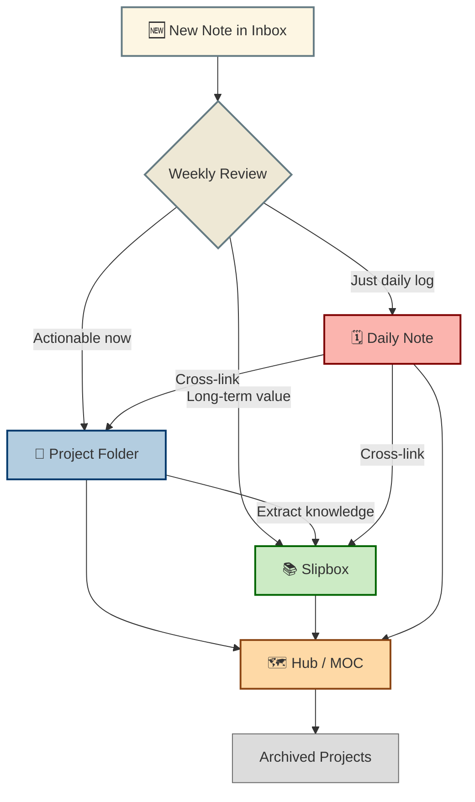

# 🗂 My Obsidian Capture-First + Hub System

## 1️⃣ Core Principle

> [!Info] **Capture everything instantly → Organise later in batches.**

Never stop to decide folders, tags, or structure when an idea hits.  
Decisions happen during a review session, not in the moment.

---

## 2️⃣ Folder Structure

> [!NOTE]
> Admin
> Assets
> Inbox          ← Everything goes here first
> Outbox         ← Optional (use for drafts/output)
> Projects       ← Active, time-bound work
> Slipbox        ← Evergreen, timeless knowledge
> Hubs           ← Dashboard notes for projects/areas
> Archive        ← Completed projects

---

## 3️⃣ Workflow

### Daily
- Dump all thoughts, tasks, notes, research into **Inbox**.
- If obvious, add a broad tag:
  - `#move` – relocation related
  - `#semester1` – current semester
  - `#ideas` – future project ideas
  - `#concept` – general concepts
- Otherwise, just capture — no tags needed.





### Weekly Review
1. **Go through Inbox**  
   - **Evergreen knowledge** → Move to **Slipbox** (atomic note, linkable).
   - **Active work** → Move to **Projects/** and tag for its hub.
   - **Someday idea** → Move to **Slipbox** with `#ideas`.
   - **Trash** → Delete if irrelevant.
2. Check hubs and update next actions/dates.

---

## 4️⃣ The Decision Rule
- Will it matter in **6–12 months outside this project**? → **Slipbox**.
- Only relevant during an active project? → **Projects**.
- Not sure? → Leave in **Inbox** until review.

---

## 5️⃣ Hubs (Dashboards)
Each big project gets one hub note in `/Hubs/`.

Example: `Move to Canada Dashboard.md`

```markdown
# Move to Canada — Hub

## 📅 Key Dates
- 2025-09-03 Flight

## ✅ Next Actions
- [ ] Finalize packing
- [ ] Notify bank

## 📄 Documents
- [[Flight Ticket]]
- [[Visa Approval]]

## 🔍 Research
tag:#move
```

Hubs are your quick-glance control centers — they pull in all tagged notes automatically.

---

## 6️⃣ Quick Capture Cheatsheet

- **Random thought / inspiration** → `Inbox` (+ `#ideas` if obvious)
- **Class notes / assignments** → `Inbox` (+ `#semester1`)
- **Interesting fact** (e.g., pollution data) → `Inbox` (+ tag if obvious)
- **Admin task** (e.g., pay fee) → `Inbox` (+ `#move` or project tag)

---

## 7️⃣ Slipbox Notes

- One idea/concept per note.
- Structure:
```markdown
# Title

**TL;DR:** Short summary (1–2 sentences)

## Key Points
- Bullet
- Bullet

## Links / Sources
- [Source name](url)

## See Also
- [[Related note]]
````

---

## **8️⃣ Mindset**

- **Capture fast** — no formatting, no worrying about “right place”.
- **Organise slow** — review calmly, link and tag with intention.
- **Keep Slipbox sacred** — only timeless knowledge.
- **Let hubs handle projects** — no endless sorting.

---
