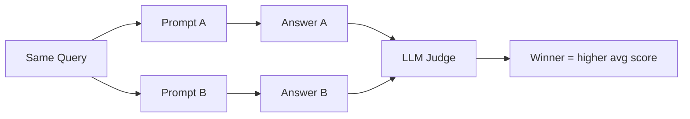
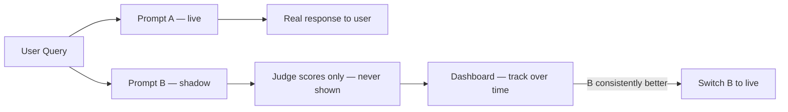

# A/B Testing Prompts & Shadow Deployment

Running two prompt variants side-by-side to determine which produces better answers — using LLM-as-judge scores as the metric.

## The Core Idea

Same query, two prompts, compare scores.



## What You're Comparing

Common things to A/B test:
- System prompt wording
- How many chunks to include in context
- Chunk ordering (top chunk first vs reranked order)
- Answer format instructions (bullet points vs prose)
- Whether to include source citations

## Shadow Deployment

The production version of A/B testing — Prompt B runs silently alongside Prompt A on real traffic, but its answers never reach users. You collect judge scores until confident B is better.



**Why not just deploy B directly?** Because LLM behaviour is probabilistic — B might score better on your test set but worse on the long tail of real queries you haven't seen.

## Eval Loop

```python
results = []
for query, chunks in production_sample:
    answer_a = pipeline.invoke(query, prompt=PROMPT_A)
    answer_b = pipeline.invoke(query, prompt=PROMPT_B)
    
    score_a = judge.score(query, chunks, answer_a)
    score_b = judge.score(query, chunks, answer_b)
    
    results.append({"a": score_a, "b": score_b})

avg_a = sum(r["a"] for r in results) / len(results)
avg_b = sum(r["b"] for r in results) / len(results)
print(f"Prompt A: {avg_a:.2f} | Prompt B: {avg_b:.2f}")
```

## Decision Rule

Don't switch on a small difference — LLM scoring has variance. A safe rule:

- Run on at least 50–100 queries
- Switch only if B beats A by >0.2 points consistently
- Check faithfulness specifically — relevance can be gamed by verbose answers

## Related
- [[LLM-as-Judge Evaluation]] — the scoring mechanism used here
- [[Precision@K & Retrieval Eval]] — retrieval-side metric to track alongside
- Latency & Observability — track that B isn't slower than A in production
