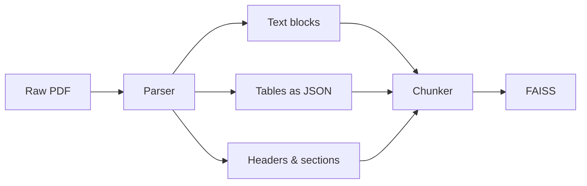

# Document Parsing (PDF → Structured JSON)

Extracting structured content from PDFs before chunking. Critical when documents contain tables, headers, or mixed layouts — raw text extraction destroys structure.

## The Problem

Raw text extraction from a PDF table gives you:

```
Drug Name Dose Side Effects Metformin 500mg Nausea fatigue Aspirin 100mg Bleeding heartburn
```

Fixed-size chunking then splits mid-row. FAISS retrieves half a table. LLM gets confused.

## The Solution

Parse into structured JSON first, preserving rows, columns, and hierarchy.



## Three Tools

| Tool | Best for |
|------|----------|
| `PyMuPDF` (fitz) | Fast text + layout extraction |
| `pdfplumber` | Tables — preserves rows and columns cleanly |
| `unstructured` | All-in-one: text, tables, images, OCR |

## Extracting a Table with pdfplumber

```python
import pdfplumber

with pdfplumber.open("report.pdf") as pdf:
    table = pdf.pages[0].extract_table()

# [["Drug Name", "Dose", "Side Effects"],
#  ["Metformin", "500mg", "Nausea, fatigue"],
#  ["Aspirin", "100mg", "Bleeding, heartburn"]]
```

## Converting Table Rows to Embeddable Sentences

Instead of embedding raw JSON (which embeds poorly), serialise each row as a natural sentence:

```python
for row in table[1:]:  # skip header
    sentence = f"{row[0]} at {row[1]} has side effects: {row[2]}"
    # "Metformin at 500mg has side effects: Nausea, fatigue"
    chunks.append(sentence)
```

These embed much better and retrieve accurately.

## Content Types in a PDF

| Type | Naive extraction | Structured parsing |
|------|-----------------|-------------------|
| Plain text | ✅ Works fine | Same |
| Tables | ❌ Flattened, unreadable | ✅ Rows/columns preserved |
| Headers | ❌ Merged with body text | ✅ Kept as metadata |
| Images | ❌ Ignored | ✅ OCR if needed |

## GroundSense Connection

Bedrock KB's native PDF ingestion does basic text extraction. PDFs with tables in hazard assessments likely have structured data being lost or mangled before chunking.

## Related
- [[Chunking Strategies]] — chunking happens after parsing
- [[BERT Embeddings]] — serialised rows embed much better than raw JSON
- [[FAISS]] — final destination for parsed and chunked content
