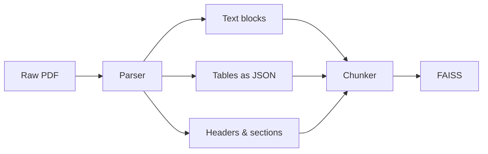

# Document Parsing (PDF → Structured JSON)

Extracting structured content from PDFs *before* chunking. Raw text extraction loses table structure, headers, and layout — parsing preserves it.

## The Problem

Raw text extraction from a table gives you:

```
Drug Name Dose Side Effects Metformin 500mg Nausea fatigue Aspirin 100mg Bleeding heartburn
```

Fixed-size chunking then splits mid-row. FAISS retrieves half a table. LLM gets confused.

## The Solution: Parse First, Then Chunk



## Three Tools

| Tool | Best for |
|------|----------|
| `PyMuPDF` (fitz) | Fast text + layout extraction |
| `pdfplumber` | Tables — preserves rows and columns |
| `unstructured` | All-in-one: text, tables, images, OCR |

## Extracting a Table with pdfplumber

```python
import pdfplumber

with pdfplumber.open("report.pdf") as pdf:
    table = pdf.pages[0].extract_table()

# Result:
# [["Drug Name", "Dose", "Side Effects"],
#  ["Metformin", "500mg", "Nausea, fatigue"],
#  ["Aspirin", "100mg", "Bleeding, heartburn"]]
```

## Converting Table Rows → Embeddable Sentences

Rather than embedding raw JSON (which embeds poorly), serialise each row as a natural sentence:

```python
for row in table[1:]:  # skip header
    sentence = f"{row[0]} at {row[1]} has side effects: {row[2]}"
    # "Metformin at 500mg has side effects: Nausea, fatigue"
```

This embeds much better because it reads like natural language.

## GroundSense Relevance

Bedrock KB's native PDF ingestion does basic text extraction. If hazard assessment PDFs contain tables (e.g. risk scores, location data), that structure is likely being lost or mangled during ingestion.

## Content Types to Handle

| Content type | Risk if ignored |
|-------------|----------------|
| Tables | Rows split mid-cell, data lost |
| Headers/section titles | Float into wrong chunk, lose context |
| Images | Completely ignored (need OCR or vision model) |
| Multi-column layouts | Columns merged into garbled text |

## Related
- [[Chunking Strategies]] — happens after parsing
- [[FAISS]] — final destination for parsed + chunked content
- [[BERT Embeddings]] — why natural language serialisation of tables embeds better
