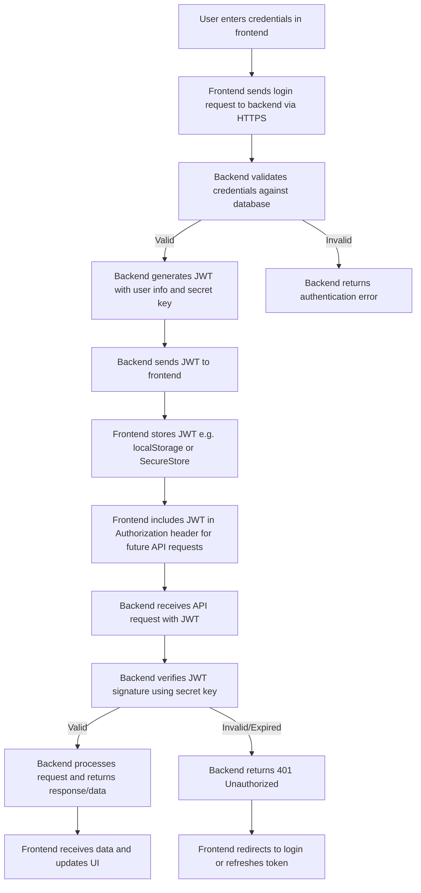

```mermaid
flowchart TD

A[User enters credentials in frontend] --> B[Frontend sends login request to backend via HTTPS]
B --> C[Backend validates credentials against database]
C -->|Valid| D[Backend generates JWT with user info and secret key]
C -->|Invalid| E[Backend returns authentication error]

D --> F[Backend sends JWT to frontend]
F --> G[Frontend stores JWT e.g. localStorage or SecureStore]
G --> H[Frontend includes JWT in Authorization header for future API requests]
H --> I[Backend receives API request with JWT]
I --> J[Backend verifies JWT signature using secret key]
J -->|Valid| K[Backend processes request and returns response/data]
J -->|Invalid/Expired| L[Backend returns 401 Unauthorized]
K --> M[Frontend receives data and updates UI]
L --> N[Frontend redirects to login or refreshes token]

```
