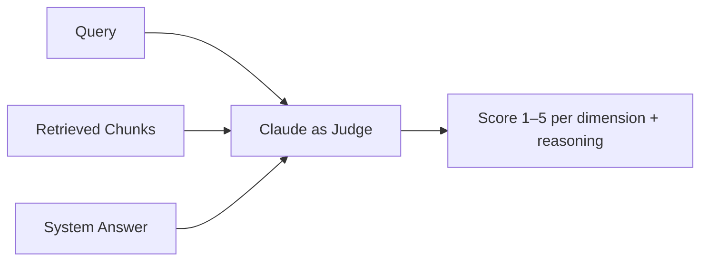

# LLM-as-Judge Evaluation

Using an LLM (e.g. Claude) to automatically score the quality of answers produced by your RAG pipeline. Complements Precision@K — measures answer quality, not just retrieval quality.

## Why "Factually Correct" Isn't Enough

An answer can be:
- ✅ Factually correct but not grounded in retrieved chunks (hallucinated from training data)
- ✅ Grounded but incomplete (missed half the answer)
- ✅ Correct and complete but irrelevant to the actual question

## The Three Dimensions

| Dimension | Question it answers | Bad example |
|-----------|-------------------|-------------|
| **Faithfulness** | Is every claim supported by the retrieved chunks? | Answer mentions a fact not in any chunk |
| **Relevance** | Does the answer address the question asked? | Correct info, wrong question answered |
| **Completeness** | Did it cover everything needed from the chunks? | Partial answer, key info omitted |

## How It Works



## Judge Prompt Pattern

```
You are evaluating a RAG pipeline response.

Query: "What are the side effects of Metformin?"

Retrieved chunks:
[1] "Metformin 500mg causes nausea and fatigue in some patients..."

System answer: "Metformin causes nausea and fatigue."

Score each dimension from 1 (poor) to 5 (excellent):
- Faithfulness: is every claim in the answer supported by the chunks?
- Relevance: does the answer address the query?
- Completeness: does the answer cover all key information in the chunks?

Return JSON: {"faithfulness": x, "relevance": x, "completeness": x, "reasoning": "..."}
```

## Eval Loop

```python
scores = []
for query, chunks, answer in test_set:
    prompt = judge_prompt(query, chunks, answer)
    result = claude.invoke(prompt)
    scores.append(parse_json(result))

avg_faithfulness = sum(s["faithfulness"] for s in scores) / len(scores)
```

## LLM-as-Judge vs Precision@K

| | Precision@K | LLM-as-Judge |
|--|-------------|--------------|
| Measures | Retrieval quality | Answer quality |
| Needs | Ground truth chunk IDs | Judge LLM |
| Catches | Wrong chunks retrieved | Hallucination, irrelevance, gaps |
| When to use | Tuning FAISS + reranker | Tuning prompts + full pipeline |

Use both together for a complete picture.

## Limitations

- Judge LLM has its own biases (tends to prefer longer, confident-sounding answers)
- Expensive if running on thousands of queries — sample strategically
- Judge prompt quality matters — a bad judge prompt gives bad scores

## Related
- [[Precision@K & Retrieval Eval]] — retrieval-side evaluation
- [[Cross-Encoder Reranking]] — use LLM-as-judge to prove reranking improved answers
- A/B testing prompts — use these scores to compare prompt variants (topic 11)
