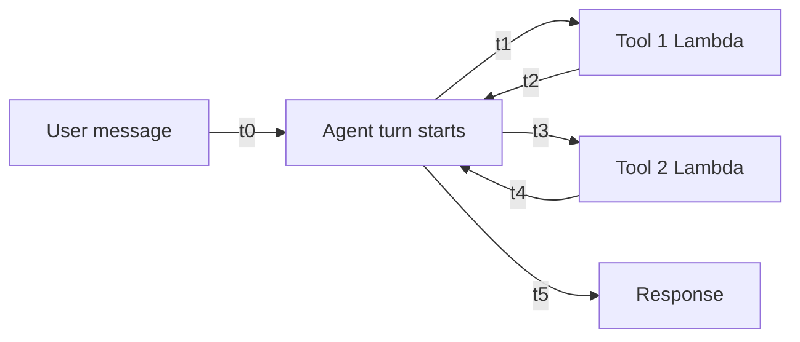

# Latency & Observability (p95, CloudWatch)

Instrumentation to understand how your pipeline performs in production — timing, tool call sequences, and failure points.

## Why Averages Lie

Always measure percentiles, not averages. Averages hide the slow tail.

```
p50 = 400ms   ← half your users
p95 = 2100ms  ← the tail that matters
p99 = 8000ms  ← something is very wrong
```

**p95** = 95% of requests finish within X ms. The 5% that don't are real users having a bad experience.

## What to Instrument in a RAG/Agent Pipeline



| Metric          | Formula              | What it tells you                   |
| --------------- | -------------------- | ----------------------------------- |
| Total latency   | t5 - t0              | End-to-end user experience          |
| Tool duration   | t2 - t1              | Which Lambda is the bottleneck      |
| Tool call count | count per turn       | Is the agent looping unnecessarily? |
| Error rate      | failed turns / total | Reliability                         |

## Adding Metrics to a Lambda (5 lines)

```python
import time, boto3

cloudwatch = boto3.client("cloudwatch")
start = time.time()

# ... existing Lambda logic ...

duration_ms = (time.time() - start) * 1000
cloudwatch.put_metric_data(
    Namespace="GroundSense",
    MetricData=[{
        "MetricName": "ToolLatency",
        "Value": duration_ms,
        "Unit": "Milliseconds",
        "Dimensions": [{"Name": "Tool", "Value": "get_hazard_assessment"}]
    }]
)
```

## Tool Call Sequences — AWS X-Ray

Enable X-Ray on your Bedrock Agent to get a flame graph of every agent turn:
- Which tools were called
- In what order
- How long each step took
- Where failures occurred

Bedrock Agent → Configuration → Enable X-Ray tracing → CloudWatch → X-Ray traces.

## CloudWatch Dashboard to Build

- p50 / p95 / p99 per tool Lambda
- Total agent turn duration over time
- Tool call count per turn (alert if > expected)
- Error rate per tool

## GroundSense Gap

Without this you can't answer:
- Which Lambda is slowest?
- How many tool calls does the agent make per query?
- Is latency getting worse over time as the KB grows?
- Which queries cause the agent to loop or fail?

## Related
- [[A-B Testing Prompts & Shadow Deployment]] — also track latency when comparing prompt variants
- [[LLM-as-Judge Evaluation]] — quality metric; pair with latency for a complete production picture
