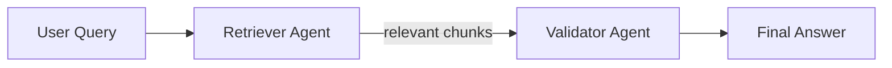
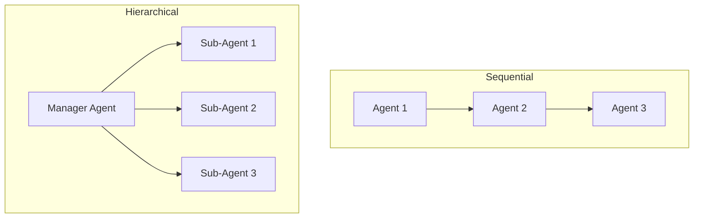
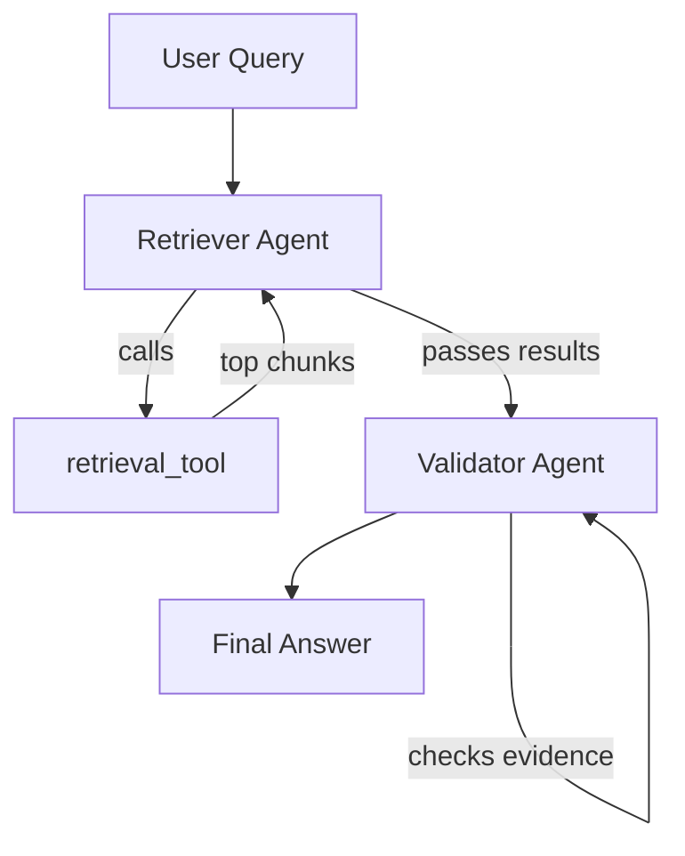

# Multi-Agent with CrewAI

Multiple specialised agents collaborating on a shared goal — each with a focused role, rather than one agent doing everything.

## Why Multi-Agent?

One agent handling too many tools and responsibilities starts making mistakes. Split responsibilities like you would in software engineering.



## Three Core Building Blocks

```python
from crewai import Agent, Task, Crew

retriever_agent = Agent(
    role="Research Specialist",
    goal="Find relevant information from the knowledge base",
    tools=[retrieval_tool]
)

validator_agent = Agent(
    role="Fact Checker",
    goal="Verify claims are supported by retrieved evidence",
    tools=[]
)

crew = Crew(
    agents=[retriever_agent, validator_agent],
    tasks=[retrieve_task, validate_task],
    process="sequential"
)

crew.kickoff(inputs={"query": "What is the return policy?"})
```

## Process Modes



| Mode | How | When |
|------|-----|------|
| **Sequential** | Agent 1 → Agent 2 → Agent 3 in order | Clear linear pipelines |
| **Hierarchical** | Manager agent delegates to sub-agents | Complex, dynamic tasks |

## Full RAG + Validation Pipeline



## GroundSense Mapping

| GroundSense                          | CrewAI equivalent              |
| ------------------------------------ | ------------------------------ |
| Bedrock Agent choosing action groups | Manager agent delegating tasks |
| `get_hazard_assessment` Lambda       | Retriever agent + tool         |
| `get_location_context` Lambda        | Second specialised agent       |
| Agent synthesising final answer      | Validator/summariser agent     |

GroundSense does this implicitly via Bedrock Agent — CrewAI makes each step an explicit agent with its own role, goal, and tools. More control, more observability.

## Related
- [[LangChain Basics]] — tools and chains that agents use
- [[FAISS]] — retrieval tool the retriever agent calls
- [[Cross-Encoder Reranking]] — can be a step inside the retriever agent
