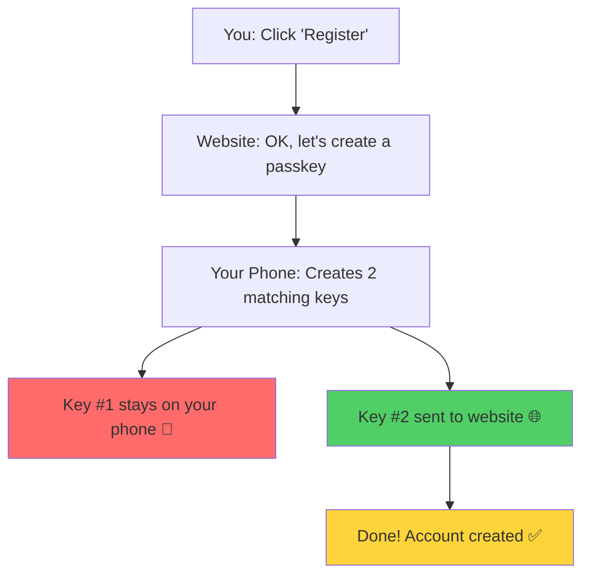
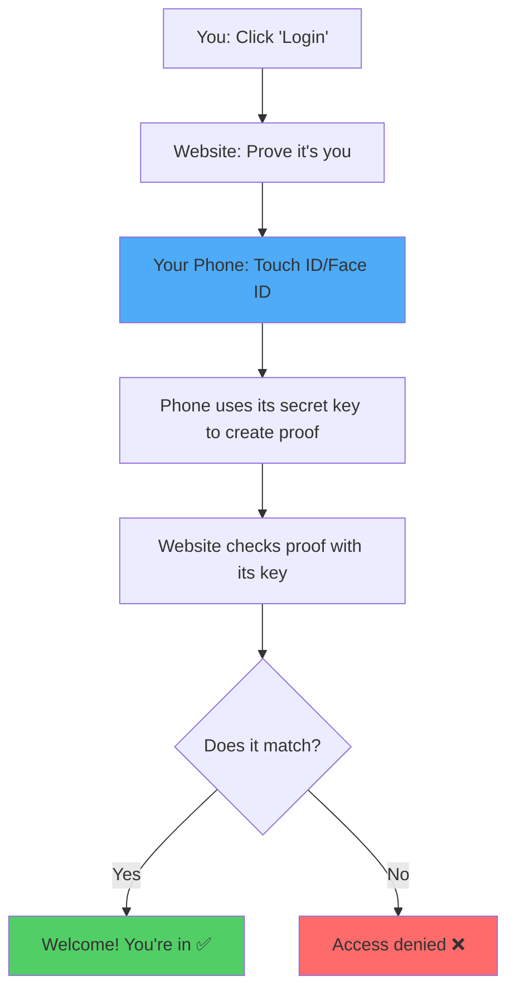

# How Passkeys Work - Simple Explanation

## The Basic Idea

Think of a passkey like a **special lock and key system** [1][4]. When you sign up on a website, your device creates two matching keys - like a lock and its key [1][5]:

- **One key stays on your phone** (never leaves, completely safe)
- **One key goes to the website** (stored in their database)

When you want to log in, the website asks "prove it's really you!" Your phone uses its secret key to create proof, and the website checks it with the key they have stored [1][6].

## Simple Registration Flow

## Simple Login Flow

## Why It's Better Than Passwords

**No memorizing** - You don't need to remember anything. Just use your fingerprint or face [1][6][10].

**Can't be stolen** - The secret key never leaves your device, so hackers can't steal it from the website [1][4][5].

**Can't be tricked** - Fake websites can't steal your passkey because it only works on the real website [4][6].

**Super fast** - Just scan your finger or face instead of typing a password [6][10].

## Real World Analogy

Imagine the website gives you a special stamp that only works with your fingerprint [1][6]:

1. **Registration**: The website makes a custom stamp for you and keeps a copy of the pattern
2. **Login**: You press your thumb on the stamp, and the website checks if the pattern matches
3. **Security**: Even if someone steals the pattern from the website, they can't use it without your actual thumb!

That's exactly what your Flask app does - your Touch ID is the "fingerprint scanner," and the keys are the "stamp and pattern" [1][6][10]!

Sources
[1] Passkeys Explained: What Is a Passkey and How Do ... https://www.dashlane.com/blog/what-is-a-passkey-and-how-does-it-work
[2] Understand passkeys in 4 minutes https://www.youtube.com/watch?v=2xdV-xut7EQ
[3] Passkeys | Google for Developers https://developers.google.com/identity/passkeys
[4] What is Passkey authentication https://www.oneidentity.com/learn/what-is-passkey-authentication.aspx
[5] What is Passkey Authentication - A Complete Guide https://www.loginradius.com/blog/identity/what-is-passkey-authentication
[6] FIDO Passkeys: Passwordless Authentication https://fidoalliance.org/passkeys/
[7] Sign in with a passkey instead of a password https://support.google.com/accounts/answer/13548313?hl=en
[8] Ask a Techspert: What are passkeys? https://blog.google/inside-google/googlers/ask-a-techspert/how-passkeys-work/
[9] Say Goodbye to Passwords: Passkeys Explained Simply https://www.youtube.com/watch?v=QYdHm7zoF_M
[10] Passkey: Simple and Secure Passwordless Sign-In https://safety.google/safety/authentication/passkey/

