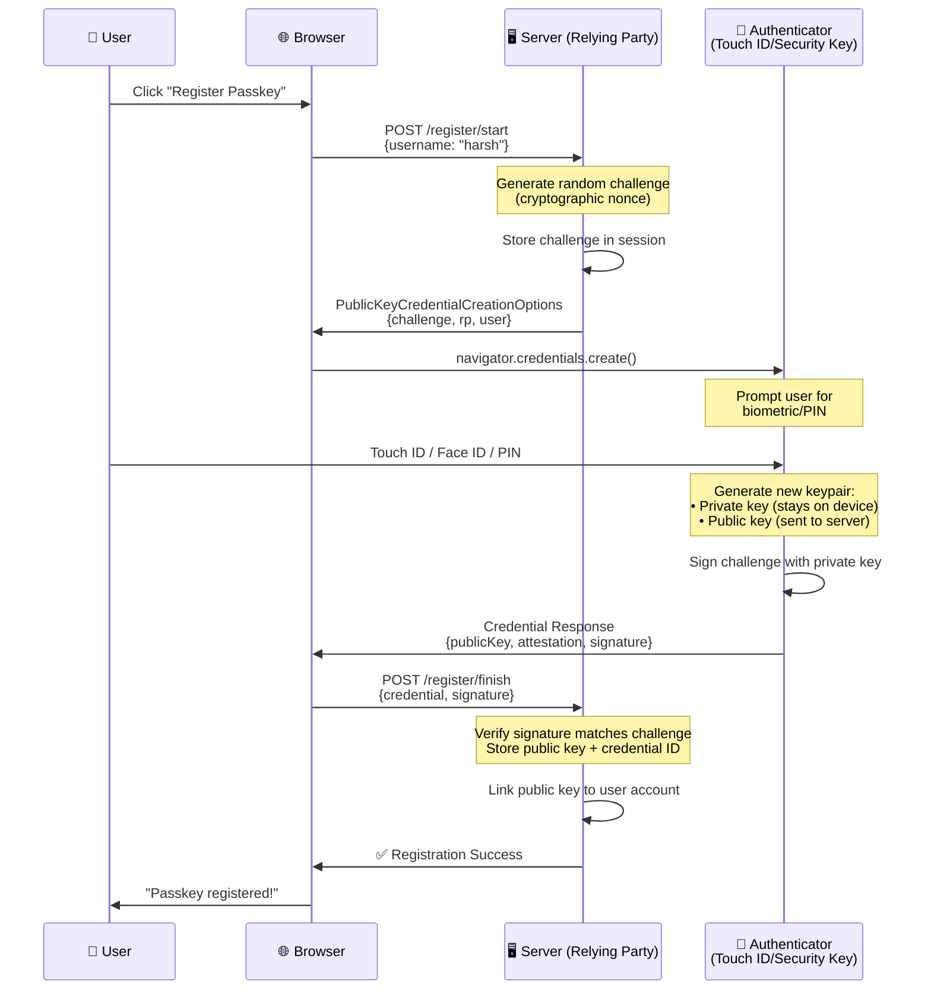
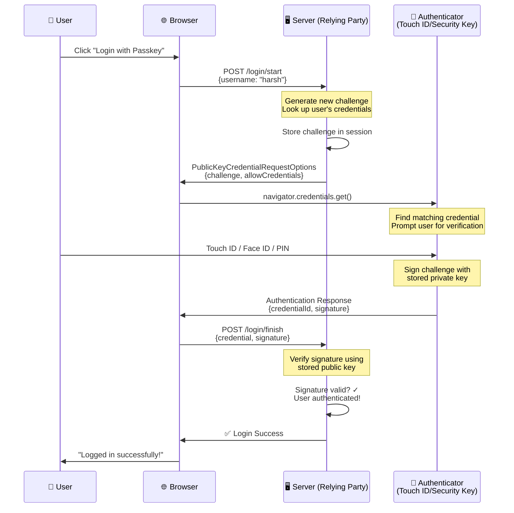
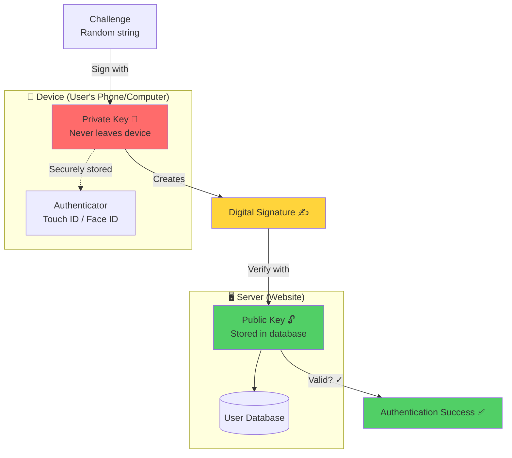
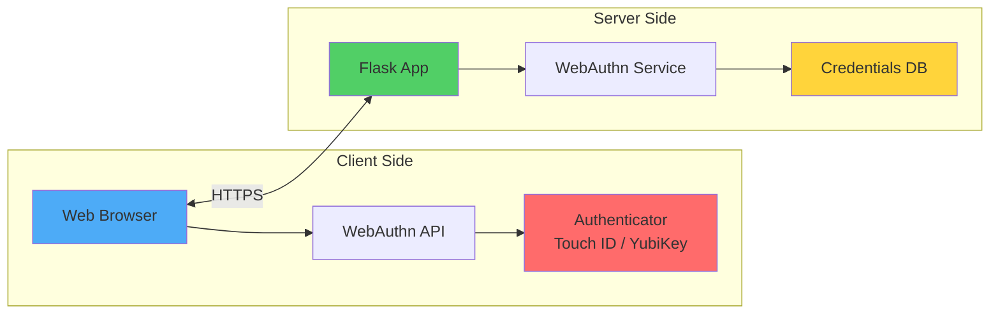

## [[Passkeys (non technical)]]

## Registration Flow (Creating a Passkey)

## Authentication Flow (Logging in with Passkey)

## Cryptographic Key Relationship

## High-Level Architecture

## Key Concepts

**Public-Private Key Pair** - During registration, the authenticator generates two mathematically linked keys [3][4][5]:
- **Private Key**: Stays on your device (never transmitted)
- **Public Key**: Stored on the server

**Challenge-Response** - The server sends a random challenge that must be signed with the private key and verified with the public key [1][6][7].

**Phishing Resistant** - Credentials are bound to the origin (domain), so they won't work on fake sites [3][5].

**No Passwords** - Your biometric data never leaves your device; only cryptographic signatures are sent [2][4][5].

This is exactly what your Flask app implements! [1][2][3]

Sources
[1] WebAuthn: How it Works & Example Flows https://www.descope.com/learn/post/webauthn
[2] What Is WebAuthn and How Does It Work? https://fusionauth.io/articles/authentication/webauthn
[3] WebAuthn Explained https://supertokens.com/blog/webauthn-explained
[4] What are passkeys and how do they work? - Clerk https://clerk.com/blog/what-are-passkeys
[5] What Is a Passkey & How Does It Work? - Descope https://www.descope.com/learn/post/passkeys
[6] Passkeys Cheat Sheet for Developers https://www.corbado.com/blog/passkeys-cheat-sheet
[7] Authentication - How it Works https://webauthn.wtf/how-it-works/authentication
[8] High level architecture of a passkey application https://developers.yubico.com/Passkeys/High_level_architecture_of_a_passkey_application.html
[9] An API for accessing Public Key Credentials - Level 3 https://www.w3.org/TR/webauthn-3/
[10] Enable Web Authentication API (WebAuthn) passkeys https://learn.microsoft.com/en-us/aspnet/core/security/authentication/passkeys/?view=aspnetcore-10.0

