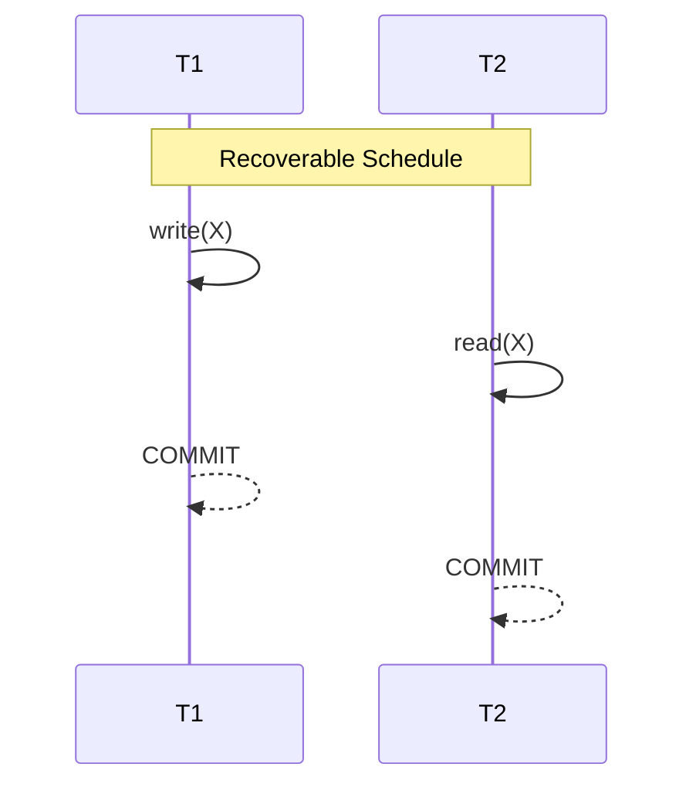
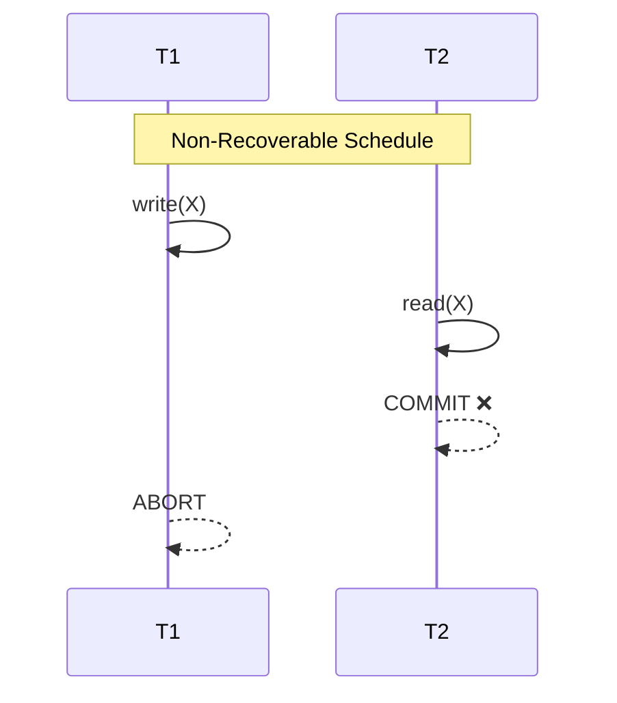

# Recoverable example

```mermaid
sequenceDiagram
    participant T1
    participant T2
    Note over T1,T2: Recoverable Schedule
    T1->>T1: write(X)
    T2->>T2: read(X)
    T1-->>T1: COMMIT
    T2-->>T2: COMMIT
```

# Non-recoverable example

```mermaid
sequenceDiagram
    participant T1
    participant T2
    Note over T1,T2: Non-Recoverable Schedule
    T1->>T1: write(X)
    T2->>T2: read(X)
    T2-->>T2: COMMIT ❌
    T1-->>T1: ABORT
```
